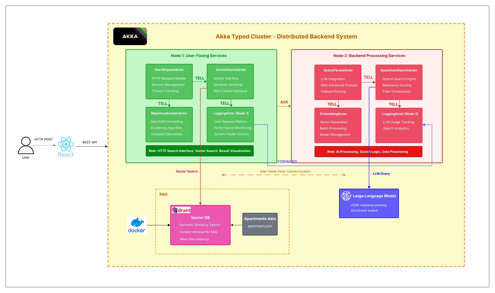

# Livora: Intelligent Apartment Finder with RAG



## Project Overview

The **Intelligent Apartment Finder** is a distributed application that revolutionizes apartment searching using natural language processing and semantic search. Built with a microservices architecture using Akka Typed clusters, it combines Google's Gemini LLM with Retrieval-Augmented Generation (RAG) to understand conversational queries and provide relevant apartment recommendations.

### Key Features
- **Natural Language Search**: Users can describe their ideal apartment in plain English
- **Semantic Understanding**: RAG-enhanced search using vector embeddings for better context
- **Distributed Architecture**: 2-node Akka cluster for scalability and resilience
- **Real-time Processing**: Asynchronous actor-based message passing
- **Interactive Map Visualization**: React frontend with Leaflet integration
- **Smart Query Parsing**: Gemini LLM converts natural language to structured search criteria

## Technology Stack

### Backend
- **Java 11+** - Core programming language
- **Akka Typed** - Actor-based concurrent and distributed computing
- **Akka HTTP** - RESTful API endpoints
- **Akka Cluster** - Distributed node management
- **Google Gemini API** - Large Language Model for NLP
- **Qdrant** - Vector database for semantic search
- **LangChain4j** - Embeddings and RAG implementation
- **Jackson** - JSON processing

### Frontend
- **React** - Component-based UI framework
- **Leaflet** - Interactive map visualization
- **Axios** - HTTP client for API calls
- **React-Leaflet** - React wrapper for Leaflet maps

### Infrastructure
- **Docker** - Containerization (optional)
- **Maven** - Build and dependency management

## System Architecture

### High-Level Architecture Flow

```
1. User Query → UserRequestActor
2. UserRequestActor → VectorSearchActor (semantic search in Qdrant)
3. VectorSearchActor → Returns similar apartments & past queries
4. UserRequestActor → QueryParserActor (with RAG context)
5. QueryParserActor → Gemini LLM (enhanced prompt with examples)
6. QueryParserActor → ApartmentSearchActor (structured criteria + semantic scores)
7. ApartmentSearchActor → Hybrid ranking algorithm
8. Results → MapVisualizationActor → User
```

### Actor-Based Microservices

#### Node 1: User-Facing Services
- **UserRequestActor**: Handles HTTP requests, orchestrates search flow
- **VectorSearchActor**: Manages Qdrant vector database interactions
- **MapVisualizationActor**: Formats apartment data for map display
- **LoggingActor**: Tracks user requests and performance metrics

#### Node 2: Backend Services
- **QueryParserActor**: Integrates with Gemini LLM for NLP
- **ApartmentSearchActor**: Implements hybrid search algorithm
- **EmbeddingActor**: Generates semantic embeddings for apartments
- **LoggingActor**: Monitors LLM usage and search patterns

### Communication Patterns

The system implements all three Akka messaging patterns:

1. **Tell Pattern** (Fire-and-forget)
   - Logging messages
   - Async notifications
   
2. **Ask Pattern** (Request-Response)
   - LLM query parsing
   - Vector similarity search
   - Apartment search requests
   
3. **Forward Pattern** (Message forwarding)
   - Preserves original sender context
   - Used for audit logging

## Project Structure

```
Livora/
├── backend/
│   ├── src/main/java/org/livora/
│   │   ├── actors/
│   │   │   ├── UserRequestActor.java
│   │   │   ├── QueryParserActor.java
│   │   │   ├── ApartmentSearchActor.java
│   │   │   ├── VectorSearchActor.java
│   │   │   ├── MapVisualizationActor.java
│   │   │   ├── EmbeddingActor.java
│   │   │   └── LoggingActor.java
│   │   ├── messages/
│   │   │   ├── Command.java
│   │   │   ├── UserRequestMessages.java
│   │   │   ├── QueryParserMessages.java
│   │   │   └── LoggingMessages.java
│   │   ├── models/
│   │   │   ├── Apartment.java
│   │   │   ├── SearchCriteria.java
│   │   │   └── ScoredApartment.java
│   │   ├── api/
│   │   │   └── RestApiRoutes.java
│   │   ├── services/
│   │   │   └── IndexingService.java
│   │   └── Main.java
│   ├── src/main/resources/
│   │   ├── application.conf
│   │   └── apartments.json
│   └── pom.xml
└── frontend/
    ├── src/
    │   ├── components/
    │   │   ├── SearchBar.jsx
    │   │   ├── ApartmentMap.jsx
    │   │   ├── ApartmentList.jsx
    │   │   └── FilterPanel.jsx
    │   ├── services/
    │   │   └── apiService.js
    │   └── App.jsx
    └── package.json
```

## Key Features Explained

### 1. RAG-Enhanced Search
The system uses Retrieval-Augmented Generation to improve search accuracy:
- **Vector Embeddings**: Each apartment is converted to a semantic vector
- **Similarity Search**: Finds apartments similar to the user's query
- **Context Enhancement**: Previous successful queries inform new searches
- **Hybrid Ranking**: Combines semantic scores with traditional filters

### 2. Natural Language Processing
Gemini LLM parses conversational queries into structured criteria:
```json
Input: "I need a pet-friendly 2BR apartment near downtown under $1800"
Output: {
  "maxPrice": 1800,
  "bedrooms": 2,
  "petFriendly": true,
  "location": "downtown",
  "proximity": "near"
}
```

### 3. Distributed Processing
- **Cluster Formation**: Automatic node discovery and failover
- **Load Balancing**: Work distribution across nodes
- **Fault Tolerance**: Actor supervision and restart strategies
- **Scalability**: Easy horizontal scaling by adding nodes

## Configuration

### Akka Configuration (application.conf)
```hocon
akka {
  actor {
    provider = cluster
    serialization-bindings {
      "org.livora.messages.Command" = jackson-json
    }
  }
  
  remote.artery {
    canonical {
      hostname = "127.0.0.1"
      port = 2551
    }
  }
  
  cluster {
    seed-nodes = [
      "akka://ApartmentSystem@127.0.0.1:2551",
      "akka://ApartmentSystem@127.0.0.1:2552"
    ]
    roles = ["user-facing"] # or "backend" for node 2
  }
}
```

## API Endpoints

### Search Apartments
```http
POST /api/search
Content-Type: application/json

{
  "query": "2 bedroom apartment with parking near university under $1500"
}
```

**Response:**
```json
{
  "results": [
    {
      "id": "apt-001",
      "title": "Modern Downtown Loft",
      "price": 1450,
      "bedrooms": 2,
      "bathrooms": 2,
      "location": {
        "address": "123 Main St",
        "latitude": 40.7128,
        "longitude": -74.0060,
        "neighborhood": "downtown"
      },
      "petFriendly": true,
      "parkingAvailable": true,
      "amenities": ["gym", "rooftop"],
      "relevanceScore": 0.92
    }
  ],
  "metadata": {
    "totalResults": 15,
    "searchTime": 245,
    "confidence": 0.95
  }
}
```

## Testing

### Unit Tests
```bash
mvn test
```

### Integration Tests
- Cluster formation verification
- Message pattern validation
- Gemini API mock testing
- End-to-end flow testing

## Performance Optimizations

1. **Caching**
   - Query result caching in QueryParserActor
   - Embedding cache in VectorSearchActor
   
2. **Batch Processing**
   - Bulk apartment indexing
   - Batch embedding generation
   
3. **Async Operations**
   - Non-blocking actor communication
   - Parallel search execution

## Monitoring and Logging

- **Structured Logging**: JSON format for log aggregation
- **Performance Metrics**: Request latency, throughput
- **LLM Usage Tracking**: Token consumption, API costs
- **Search Analytics**: Popular queries, success rates
